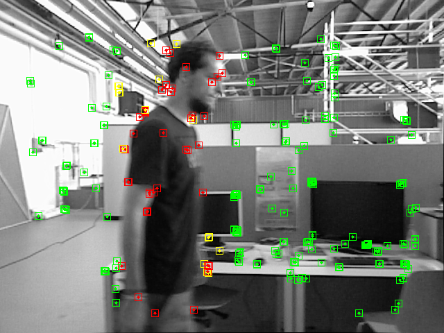

# Dyn-ORB-SLAM
**Authors:** [WChenxu2018](https://github.com/WChenxu2018)

Dyn-ORB-SLAM is a real-time visual SLAM library for **Monocular**, **Stereo** and **RGB-D** which achieve a good result in the dynamic environment. Specifically, we adopt a fast object detection network and we tightly couple the results of the object detection with the geometric information in the SLAM system. We provide examples to run the SLAM system in the [KITTI dataset](http://www.cvlibs.net/datasets/kitti/eval_odometry.php) as stereo or monocular, in the [TUM dataset](http://vision.in.tum.de/data/datasets/rgbd-dataset) as RGB-D. We also provide a ROS node to process live stereo streams. **The library can be compiled without ROS**.




# 1. License

Dyn-ORB-SLAM is built on ORB_SLAM2. ORB-SLAM2 is released under a [GPLv3 license](https://github.com/raulmur/ORB_SLAM2/blob/master/License-gpl.txt). For a list of all code/library dependencies (and associated licenses), please see [Dependencies.md](https://github.com/raulmur/ORB_SLAM2/blob/master/Dependencies.md).


# 2. Prerequisites
We test the library in ubuntu16.04 and OpenCV 3.4.8. LibTorch v1.3.1 and cuda are required for the project.

## Getting started
- Install ORB-SLAM2 prerequisites: C++11 or C++0x Compiler, Pangolin, OpenCV and Eigen3  (https://github.com/raulmur/ORB_SLAM2).
- Install LibTorch for the library (https://github.com/pytorch/pytorch).
- Download the `yolov3.weights` from (https://pjreddie.com/media/files/yolov3.weights and place the `yolov3.weights` model in the folder `Dyn-ORB-SLAM/config/`.
- Clone this repo:
```bash
git clone https://github.com/WChenxu2018/Dyn-ORB-SLAM
cd Dyn-ORB-SLAM
chmod +x build.sh
./build.sh
```

# 3. Monocular Examples on KITTI Dataset

1. Download the dataset (grayscale and color images) from http://www.cvlibs.net/datasets/kitti/eval_odometry.php. Place the image_0 file of the color image into the grayscale image and rename this file to image_2.

2. Execute the following command. Change `KITTIX.yaml`by KITTI00-02.yaml, KITTI03.yaml or KITTI04-12.yaml for sequence 0 to 2, 3, and 4 to 12 respectively. Change `PATH_TO_DATASET_FOLDER` to the uncompressed dataset folder. Change `SEQUENCE_NUMBER` to 00, 01, 02,.., 11. 
```
./Examples/Monocular/mono_kitti Vocabulary/ORBvoc.txt Examples/Monocular/KITTIX.yaml PATH_TO_DATASET_FOLDER/dataset/sequences/SEQUENCE_NUMBER
```

# 4. Stereo Examples on KITTI Dataset

1. Download the dataset (grayscale images and color images) from http://www.cvlibs.net/datasets/kitti/eval_odometry.php.  Place the image_0 file of the color image into the grayscale image and rename this file to image_2.

2. Execute the following command. Change `KITTIX.yaml`to KITTI00-02.yaml, KITTI03.yaml or KITTI04-12.yaml for sequence 0 to 2, 3, and 4 to 12 respectively. Change `PATH_TO_DATASET_FOLDER` to the uncompressed dataset folder. Change `SEQUENCE_NUMBER` to 00, 01, 02,.., 11. 
```
./Examples/Stereo/stereo_kitti Vocabulary/ORBvoc.txt Examples/Stereo/KITTIX.yaml PATH_TO_DATASET_FOLDER/dataset/sequences/SEQUENCE_NUMBER
```

# 5. RGB-D Example on TUM Dataset

1. Download a sequence from http://vision.in.tum.de/data/datasets/rgbd-dataset/download and uncompress it.

2. Associate RGB images and depth images using the python script [associate.py](http://vision.in.tum.de/data/datasets/rgbd-dataset/tools). We already provide associations for some of the sequences in *Examples/RGB-D/associations/*. You can generate your own associations file executing:

  ```
  python associate.py PATH_TO_SEQUENCE/rgb.txt PATH_TO_SEQUENCE/depth.txt > associations.txt
  ```

3. Execute the following command. Change `TUMX.yaml` to TUM1.yaml,TUM2.yaml or TUM3.yaml for freiburg1, freiburg2 and freiburg3 sequences respectively. Change `PATH_TO_SEQUENCE_FOLDER`to the uncompressed sequence folder. Change `ASSOCIATIONS_FILE` to the path to the corresponding associations file.

  ```
  ./Examples/RGB-D/rgbd_tum Vocabulary/ORBvoc.txt Examples/RGB-D/TUMX.yaml PATH_TO_SEQUENCE_FOLDER ASSOCIATIONS_FILE
  ```

# 6. ROS Examples

### Building the nodes for stereo 
1. Add the path including *Examples/ROS/ORB_SLAM2* to the ROS_PACKAGE_PATH environment variable. Open .bashrc file and add at the end the following line. Replace PATH by the folder where you cloned Dyn-ORB-SLAM:

  ```
  export ROS_PACKAGE_PATH=${ROS_PACKAGE_PATH}:PATH/ORB_SLAM2/Examples/ROS
  ```
  
2. Execute `build_ros.sh` script:

  ```
  chmod +x build_ros.sh
  ./build_ros.sh
  ```
  
### Running Stereo Node
For a stereo input from topic `/camera/left/image_raw` and `/camera/right/image_raw` run node ORB_SLAM2/Stereo. You will need to provide the vocabulary file and a settings file. If you **provide rectification matrices** (see Examples/Stereo/EuRoC.yaml example), the node will recitify the images online, **otherwise images must be pre-rectified**.

  ```
  rosrun ORB_SLAM2 Stereo PATH_TO_VOCABULARY PATH_TO_SETTINGS_FILE ONLINE_RECTIFICATION
  ```

# 7. SLAM and Localization Modes
You can change between the *SLAM* and *Localization mode* using the GUI of the map viewer.

### SLAM Mode
This is the default mode. The system runs in parallal three threads: Tracking, Local Mapping and Loop Closing. The system localizes the camera, builds new map and tries to close loops.

### Localization Mode
This mode can be used when you have a good map of your working area. In this mode the Local Mapping and Loop Closing are deactivated. The system localizes the camera in the map (which is no longer updated), using relocalization if needed. 

